```{css, echo=FALSE}
# CSS for including pauses in printed PDF output (see bottom of lecture)
@media print {
  .has-continuation {
    display: block !important;
  }
}
.remark-code-line {
  font-size: 95%;
}
.small {
  font-size: 75%;
}
.scroll-output-full {
  height: 90%;
  overflow-y: scroll;
}
.scroll-output-75 {
  height: 75%;
  overflow-y: scroll;
}
```

```{r setup, include=FALSE}
options(htmltools.dir.version = FALSE)
library(knitr)
library(fontawesome)
knitr::opts_chunk$set(
	fig.align = "center",
	cache = FALSE,
	dpi = 300,
  warning = F,
  message = F,
	fig.height = 5,
	out.width = "80%"
)
```

# Table of Contents

1. [Prologue](#prologue)

2. [Scraping Dynamic Websites](#dynamic)

---
class: inverse, middle
name: prologue

# Prologue


---
# Packages for Today

Today we'll pick up with scraping dynamic websites.

For this we'll need the following packages:

Static:
```{r}
pacman::p_load(lubridate, rvest, stringr, tiydverse, tidyr)
```

and for dynamic scraping:

```{r}
pacman::p_load(chromote, selenider)
```
  
---
class: inverse, middle
name: dynamic

# Scraping Dynamic Websites

---
# Dynamic Websites

.hi-medgrn[Dynamic client-side websites] are those are rendered dynamically and require .hi-medgrn[interaction] in order to obtain desired information.

While .hi-slate[rvest] can help us retrieve urls and element contents, it can't interact with .hi-purple[dynamically-generated or interactive] websites.<sup>1</sup>

--

To do that, we're going to take advantage of .hi-blue[browser automation] methods.

.footnote[<sup>1</sup> .hi-slate[rvest] has some functionality for live site interaction, but it is not as complete as the other options we'll see shortly.]

---
# Browser Automation

The main idea behind browser automation is this:

  > If a website requires pointing/clicking/typing to reveal the contents we want, why not have software "drive" a browser for us?
  
--

.pull-left[.hi-medgrn.center[Old Approach: RSelenium]
  * R bindings for the Selenium webdriver
  * Requires some additional software (i.e. Docker)
  * Additional steps to get it working with Mac OS X
]
--
.pull-right[
.hi-purple.center.underline[New Approach: selenider]
  * Uses .hi-slate[chromote] or Selenium automation tools to drive a Chrome browser
  * Syntax more closely matches tidyverse
  * Can't do some more complex things yet (i.e. click-and-hold, click a point)
]

---

# Application: Traverse City Properties

Let's work through an example of an interactive workflow for .hi-medgrn[property characteristics and tax info in Traverse City].

Suppose, hypothetically, that you just came into a hefty inheritance. You've decided the best course of action is to blow it all on a nice new place up north in Traverse City.

---

# Application: Traverse City Properties

After a little time scrolling real estate websites, you find a nice candidate:


.center[
```{r, echo=F, out.width="800"}
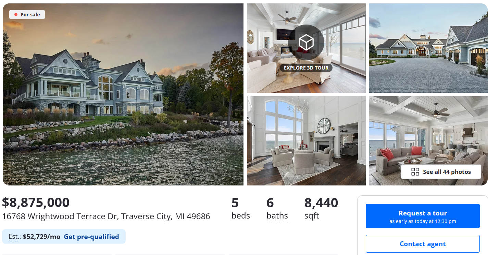
```
]

---

# Application: Traverse City Properties

While you can find a decent amount of property info on the real estate site's page, you want to make sure that this would be a "responsible" purchase by verifying the tax assessed value and school district.


So, you navigate to the [Grand Traverse County Parcel Info Website](https://maps.grandtraverse.org/propertysearch.asp) to see if you can find the info.


.center[
```{r, echo=F, out.width="450"}
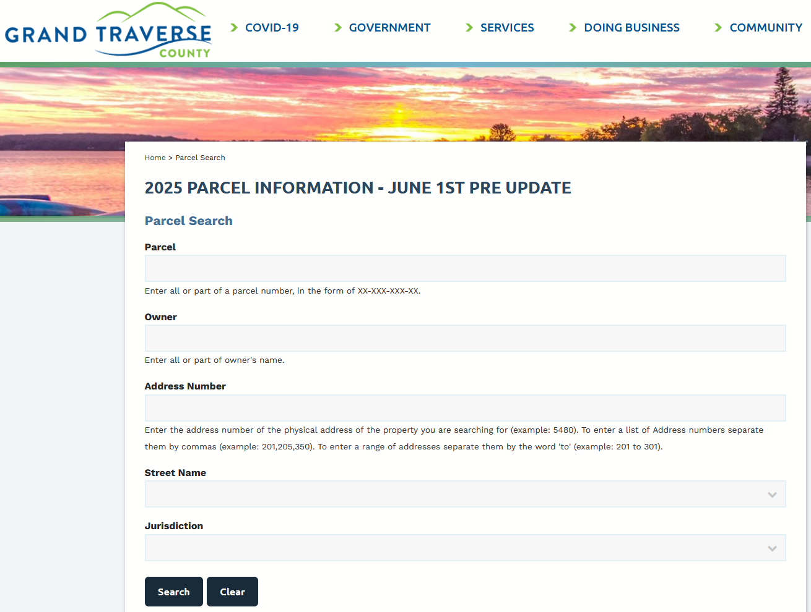
```
]


---

# Application: Traverse City Properties

After searching for the address, you find a little bit of information, including the .hi-medgrn[parcel number (APN)]. 


.center[
```{r, echo=F, out.width="800"}
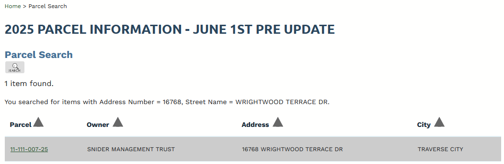
```
]

You recall that Grand Traverse City has a [Parcel Map Viewer Website](https://grand-traverse.maps.arcgis.com/apps/webappviewer/index.html?id=1f27e1d5c8bc4d8ea91e000305a8b6eb) that has a search by APN feature and contains a lot of information - including school district and property tax values!

---

# Application: Traverse City Properties

So, you navigate over to the [Parcel Map Viewer Website](https://grand-traverse.maps.arcgis.com/apps/webappviewer/index.html?id=1f27e1d5c8bc4d8ea91e000305a8b6eb):

.center[
```{r, echo=F, out.width="800"}
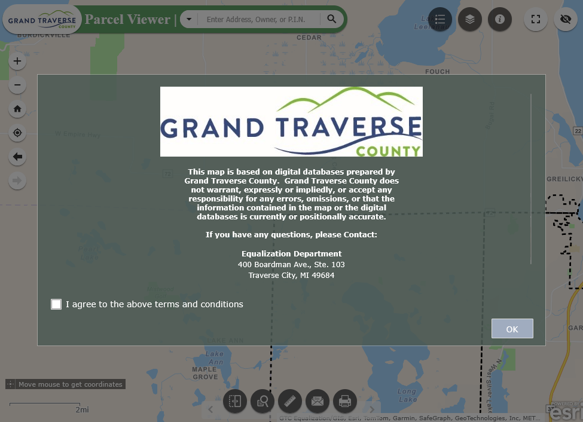
```
  ]

---

# Application: Traverse City Properties

After checking the "I agree" box and clicking "OK", you click the dropdown to change the search type to "Parcel by ID", input the APN, and hit search.


.center[
```{r, echo=F, out.width="800"}
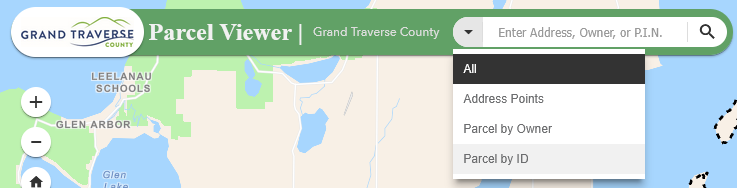
```
  ]


---

# Application: Traverse City Properties

This zooms you to the parcel shape *and* pulls up a ton of info, which includes the school district and current assessed/taxable home value!


.center[
```{r, echo=F, out.width="650"}
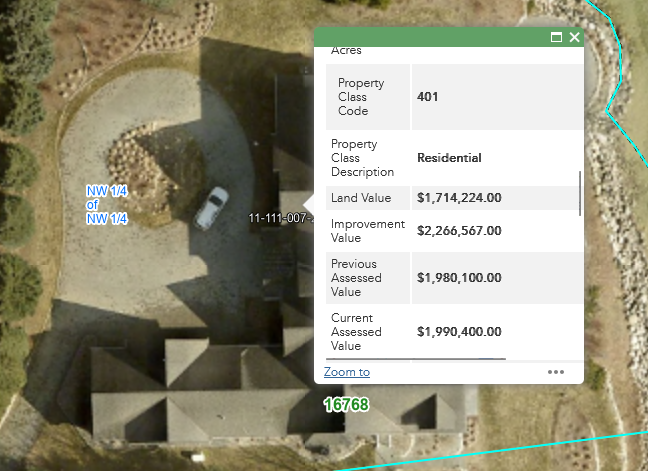
```
  ]

---

# Application: Traverse City Properties

Taking a step back, what is the workflow to go *from* an address *to* the displayed info on the parcel viewer map app?

1\. Find the address' APN using the Property Info Site
--

  * Plug in the street number
--

  * Type the street address and select the autocomplete option
--

  * Hit the search button
--

* Wait for the page to load, then copy the APN
--


2\. Find the property info for that APN on the Map Viewer
--

  * Check the "I agree" box and click OK button
--

  * Click the search dropdown and select "Parcel by ID"
--

  * Enter the parcel's APN and click search button
--

  * Copy the info that pops up in the window


---
# Launch Automated Session

First, we need to .hi-medgrn[initiate an automated browser session] with `selenider_session()`.<sup>2</sup>

```{r}
session <- selenider_session(
  browser = "chrome", # browser to drive
  session = "chromote", # set backend to chromote
  timeout = 10 # set timeout to 10 sec
)
```

--

We've now created a .hi-blue[local session]
  * Accessed anywhere in a given script/RMarkdown file
  * Closes automatically when the script/file finishes
  * If started within a function, closes when the function is done running

.footnote[<sup>2</sup> The full list of .hi-slate[selenider] functions can be found [here](https://ashbythorpe.github.io/selenider/reference/index.html)]

---
# View the Session

If you want to  .hi-blue[view the browser session], we need to add the argument

.center[`options = chromote_options(headless = F)`]

Which will open the session in your Chrome browser

```{r, eval = F}
session <- selenider_session(
  browser = "chrome", # browser to drive
  options = chromote_options(headless = F), # view the session
  "chromote", # set backend to chromote
  timeout = 10 # set timeout to 10 sec
)
```

---
# 1. Navigate to Property Info Site

Let's start by navigating to the [Grand Traverse County Parcel Info Website](https://maps.grandtraverse.org/propertysearch.asp)

  * `open_url("URL")`


```{r}
  open_url("https://maps.grandtraverse.org/propertysearch.asp")
```

---
# 1. Navigate to Property Info Site


Check that we ended up at the desired url:

```{r}
current_url()
```

---
#  Global Functions

Other actions that apply globally to the entire page:

| Function | Task |
| -------  | -----|
| `open_url()` | navigate to the indicated url |
| `current_url()` | get the current url |
| `get_page_source()` | get the page's HTML|
| `back(), forward()` | navigate forward or back|
| `reload(), refresh()` | reload the current page|
| `take_screenshot()` | take screenshot of current image|
| `execute_js_fn(), execute_js_expr()` | execute a JavaScript function |


---
# Selection Functions

Some additional selection functions:

| Function | Task |
| -------  | -----|
| `s(), ss()` | select HTML elements (without specifying the session)|
| `find_element()` | find a single HTML child element (yields a `selenider-element` object) |
| `find_elements()` | find multiple HTML child elements (yields a `selenider-elements` object) |
| `elem_filter(), elem_find()` | extract a subset of HTML elements|

---
# Selection Functions

Hold up James, you're telling me that there are .hi-medgrn[six] different functions ?? Which should I be using?

--

.hi-blue[Thoughts:]

* `s()` is equivalent to `session %>% find_element()`
* `ss()` is equivalent to `session %>% find_elements()`
--

* `s()/find_element()` and `ss()/find_elements()` let you search by
  * CSS Selector (`css`)
  * XPath (`xpath`)
  * element ID (`id`), class (`class_name`), name (`name`)
--

* `elem_find()` and `elem_filter()` let us search by .hi-purple[conditions]
  * i.e. has certain text, has an attribute with a certain value, is visible, has a certain number of elements
  * We'll see helper functions that will help us out with this in a bit


---
# Element Properties

And functions for obtaining element properties

| Function | Task |
| -------  | -----|
| `elem_attr(), elem_attrs(), elem_value()` | Get attributes of an element|
| `elem_css_property()` | Get a CSS property of an element|
| `elem_name()` | Get the tag name of an element |
| `elem_size(), length(selenider-elements)` | get the number of elements in a collection|
| `elem_text()` | Get the text inside an element |
| `elem_equal()` | Test if two elements are equal|

---
# Actions

| Function | Task |
| -------  | -----|
| `elem_click(), elem_double_click(), elem_right_click()` | Click on an element|
| `elem_hover(), elem_focus` | Hover over an element|
| `elem_scroll_to()` | Scroll to an element |
| `elem_select()` |Select an HTML element|
| `elem_set_value(), elem_send_keys(), elem_clear_value()` | Set the value of an input |
| `elem_submit()` | Submit an element|
| `keys` | list of special keys |


---
# 1. Navigate the Property Info Site

Now let's think about the steps and functions need to .hi-medgrn[enter the address information] and then click hi-medgrn[Search] to try and track down the APN.

.hi-slate[Involved Steps:]
  * .hi-blue[Find] the Address Number field (`find_element()`)
  * .hi-red[Type] the address number into the field (`elem_send_keys()`)
  * .hi-blue[Find] the Street Name field (`find_element()`)
  * .hi-red[Type] the street name into the field (`elem_send_keys()`)
  * .hi-purple[Click] the "Search" button (`find_element(), elem_click()`)

---
# Fill the Address Number Field

.center[
```{r, echo=F, out.width="700"}
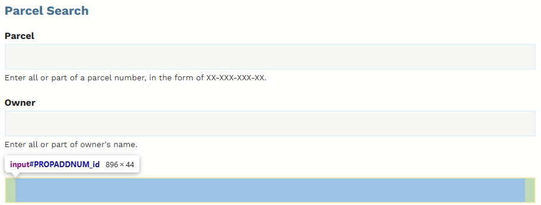
```
]

--

```{r}
session %>%
  find_element(id = "PROPADDNUM_id") %>%
  elem_send_keys("16768")
```


---
# Fill the Street Name Field

.center[
```{r, echo=F, out.width="500"}
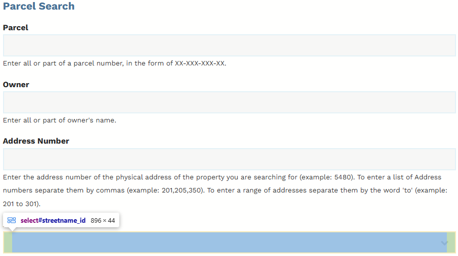
```
]

--

```{r}
session %>%
  find_element(id = "streetname_id") %>%
  elem_send_keys("Wrightwood Terrace Drive")
```

---
# Click the Search Button


.center[
```{r, echo=F, out.width="500"}
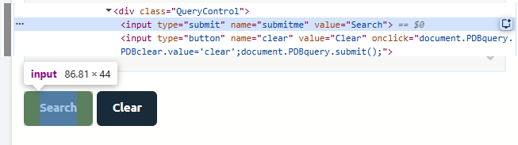
```
]

--

```{r}
session %>%
  find_element(name = "submitme") %>%
  elem_click()
```


---
# Grab the APN

.center[
```{r, echo=F, out.width="500"}
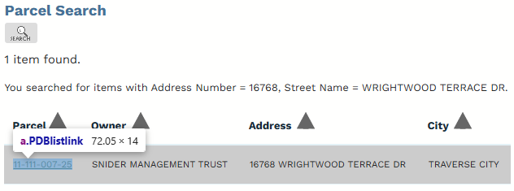
```
]

--

```{r}
apn <- session %>%
  find_element("a.PDBlistlink") %>%
  elem_text()
apn
```


---
# 2. Navigate Map Viewer

Now we'll .hi-medgrn[click the "I agree to the above terms and conditions" checkbox] and then .hi-medgrn[click OK] to launch the app.

.hi-slate[Involved Steps:]
  * .hi-blue[Select] the checkbox element by its CSS selector (`find_element()`)
  * .hi-medgrn[Scroll to] the box (`elem_scroll_to()`)
  * .hi-purple[Click] the box (`elem_click()`)
  * Repeat to select/scroll to/click the OK button


---
# 2. Navigate the Map Viewer


Navigate to the main [Tax Mapping Viewer page](https://ingham-equalization.rsgis.msu.edu/) and launch the viewer


```{r}
  open_url("https://grand-traverse.maps.arcgis.com/apps/webappviewer/index.html?id=1f27e1d5c8bc4d8ea91e000305a8b6eb/")
Sys.sleep(5)
```

---
# 2. Navigate the Map Viewer

Check that we ended up at the desired url:

```{r}
current_url()
```
---

# Click the "I Agree" Check Box

.pull-left.font90[
```{r}
session %>%
  find_element("#jimu_dijit_CheckBox_0") %>%
  elem_text()

session %>%
   find_element("div.checkbox")  %>%
  elem_scroll_to() %>% # move the cursor to the button
  elem_click()
```
]
.pull-right[
```{r, echo=F, out.width="500"}
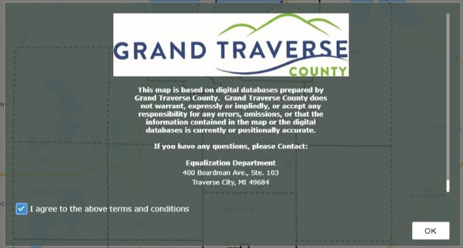
```
]

---
# Click the "OK" Button
.pull-left.font90[
```{r}
# Alternative approach: the footer contains both the check box and the OK button
session %>%
  find_element("div.footer") %>%
  find_element("button")  %>%
  elem_scroll_to() %>% # move the cursor to the button
  elem_click()
Sys.sleep(5)
```
]
.pull-right[
```{r, echo=F, out.width="500"}

```
]

---
# Choose the "Parcel by ID" Search
```{r, echo=F, out.width="500"}
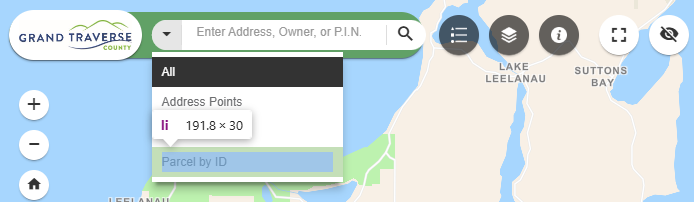
```

```{r}
# Show the search options
session %>%
  find_element("#esri_dijit_Search_0_menu_button > span.searchIcon.esri-icon-down-arrow") %>%
  elem_click()

# select the fourth list element
session %>%
  find_element("#esri_dijit_Search_0 > div > div.searchMenu.sourcesMenu > ul > li:nth-child(4)") %>%
  elem_click()
```


---
# Type in the APN

```{r, echo=F, out.width="600"}
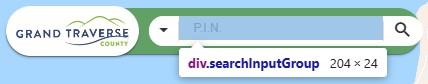
```

```{r}
# Show the search options
session %>%
  find_element("#esri_dijit_Search_0_input") %>%
  elem_send_keys(apn)
```


---
# Press Search Button

```{r, echo=F, out.width="600"}
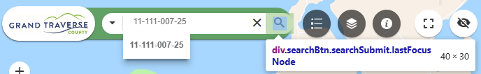
```

```{r}
# Show the search options
session %>%
  find_element("div.searchBtn.searchSubmit.lastFocusNode") %>%
  elem_click()
Sys.sleep(5)
```


---
# Get the Resulting Info Table

Here the info window contains several HTML Tables: 

```{r, echo=F, out.width="600"}
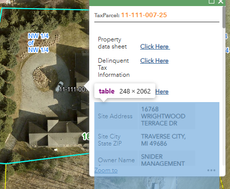
```

---
# Get the Resulting Info Table

Here the info window contains several HTML Tables: 

```{r}
session %>%
  find_elements("table") 
```


---
# Get the Resulting Info Table


We can also use .hi-medgrn[condition functions] to help with selection.
.small[
| Function | Task |
| -------  | -----|
| `has_text(), has_exact_text()` | has text that partially or fully matches |
| `has_attr(), attr_contains(), has_value()` | does the attribute match a value |
| `has_css_property()` | does an element's CSS property match a value (class, id, title, etc.)|
| `has_name()` | does an element have a tag name |
| `has_length(), has_size(), has_at_least()` | does a collection have a certain number of elements |
| `is_present(), is_in_dom(), is_absent()` | does an element exist|
| `is_visible(), is_displayed(), is_hidden(), is_invisible()` | is an element visible|
]

---
# Get the Resulting Info Table

We can also use .hi-medgrn[condition functions] to help with selection.
  * `find_elements()` to yield a `selenider_element`
  * `elem_find()` to extract a specific subset of HTML elements
    * `has_text()` to grab the element with the text "Search"
  * `elem_click()` to click the selected button.
  
```{r}
session %>% find_elements("table") %>%
  elem_find(has_text("Site Address")) %>%
  elem_text()
```

---
# Get the Resulting Info Table

.hi-slate[selenider] doesn't have built-in methods for reading HTML tables as data frames like we could in .hi-slate[rvest]...

.. but we've already queried the website and had it populate the HTML with the info we need, so let's just pull the current HTML and use .hi-slate[rvest] methods as before!

```{r}
res_tab <- get_page_source() %>%
  rvest::html_element("#esri_dijit__PopupRenderer_0 > div.mainSection > div:nth-child(3) > table:nth-child(2)")%>%
  rvest::html_table()
```

---
# Get the Resulting Info Table


```{r, eval = T}
dplyr::select(res_tab, X1, X2) %>% 
  dplyr::filter(str_detect(X1, "Mailing|School District|Value"))
```

---
# Back to Boston Marathon

Now that we've learned how to use dynamic scraping methods with .hi-slate[selenider], let's go back to our initial motivation: scraping [2025 Boston Marathon results](https://results.baa.org/2025/?pid=list&pidp=start)

```{r, echo=F}
include_graphics("images/boston_search.png")
```

---
# Back to Boston Marathon

Let's take a look at Conner Mantz's result. He broke the longstanding American marathon record of 2:05:38 at the 2025 Chicago Marathon (October 12) by almost a full minute! 

How far off was he earlier this year at Boston? Let's check!

```{r, echo=F, out.width = "700"}

```

---
# Back to Boston Marathon

.hi-medgrn[Workflow:]
* Start a .hi-slate[selenider] session (or use the currently-open one)
* Navigate to the [2025 Boston Marathon results search page](https://results.baa.org/2025/?pid=list&pidp=start)
* Select the "Result Lists" form (`form_lists_default`)
* Use the "Age Group" form to select the "18-39" option
* Use the "Results/Page" dropdown to select 100
* Filter to Conner Mantz

---
# Back to Boston Marathon

First, navigate to the [2025 Boston Marathon results search page](https://results.baa.org/2025/?pid=list&pidp=start)
```{r}
open_url("https://results.baa.org/2025/?pid=start&pidp=start")
```

And select the form using the `form_lists_default` name:

```{r}
find_element(session, name = "form_lists_default")
```

---
# Back to Boston Marathon

Within the form, we want to interact with a `select` element. To do this, use `elem_select()` on the desired option
  * Here, I used XPath syntax for the "18-39" option.
  * SelectorGadget gives an XPath that works: `//*[@id="default-lists-age_class"]/option[2]`

.more-left.font90[
```{r}
find_element(session, name = "form_lists_default") %>%
  find_element(name = "search[age_class]") %>% # select the "Ag Group" dropdown
  find_element(xpath = "//*[@id=\"default-lists-age_class\"]/option[2]") %>%
  elem_select()
```
]
.less-right[
```{r, echo=F}
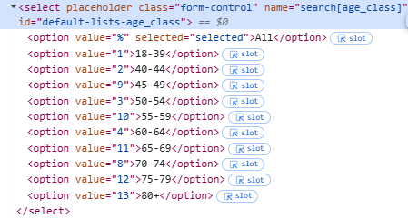
```
]

---
# Back to Boston Marathon

We can verify that our selection worked by viewing the age class search element
  * Note which option now shows as "selected"
.more-left[
```{r}
find_element(session, name = "form_lists_default") %>%
  find_element(name = "search[age_class]")
```
]
.less-right[
```{r, echo=F}
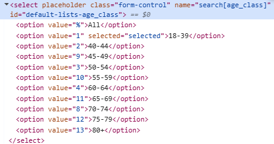
```
]

---
# Back to Boston Marathon

Next, use the same approach with `elem_select()` to change the results per page option to 100
  * This time, using SelectorGadget's CSS selector!

.more-left.font90[
```{r}
find_element(session, name = "form_lists_default") %>%
  find_element(name = "num_results") %>% # select the "Ag Group" dropdown
  find_element("#default-num_results > option:nth-child(3)")%>%
  elem_select()
```
]
.less-right[
```{r, echo=F, out.width="500"}
include_graphics("images/select_num.png")
```
]


---
# Back to Boston Marathon

Finally, find and click the button!

```{r}
find_element(session, name = "form_lists_default") %>%
  find_element(name = "submit") %>%
  elem_click()
Sys.sleep(5)
```

```{r, echo=F}
include_graphics("images/click_button.png")
```


---
# Back to Boston Marathon

Our page has now been populated with the matching search results!

Retrieve the page's current HTML with `get_page_source()`, and then we can use .hi-slate[rvest] methods to retrieve the text we want.

```{r}
Sys.sleep(5)
res_page1 <- get_page_source() %>%
  html_elements("div.row") %>%
  html_elements("li.list-group-item.row") %>%
  html_text2()
head(res_page1)
```
---
# Back to Boston Marathon

**Challenge:** format the page 1 results as a dataframe, splitting into all 9 columns
  * Back to data wrangling/cleaning!
  * _hint:_ use `separate_wider_delim()`


---
# Back to Boston Marathon

**Challenge:** format the page 1 results as a dataframe, splitting into all 9 columns
  * Back to data wrangling/cleaning!
  * _hint:_ use `separate_wider_delim()`

---
# Back to Boston Marathon

```{r}
page1_df <- data.frame(string = res_page1[2:length(res_page1)]) %>%
  separate_wider_delim(cols = string, delim = "\n",
                       names = c("place_overall", "place_gender", "place_division", "name", "team_dup", "team", "bib_dup", "bib", "half_dup", "half", "finish_net_dup", "finish_net", "finish_gun_dup", "finish_gun")) %>%
  dplyr::select(-ends_with("dup"))

head(page1_df)
```

---
# Conner Mantz at Boston Marathon

And looking for Conner's result:

```{r}
dplyr::filter(page1_df, str_detect(name, "Mantz")) %>%
  dplyr::select(name, place_overall, finish_net)
```
But that was national record worthy too! What's up?

---
# Boston is net downhill point-to-point

It violates a World Athletic's rule:

  > The overall decrease in elevation between start and finish shall not exceed an average of one meter per kilometer.
  
(It drops 140 meters over 42.16km)

*But* it showed that he was very likely to beat it officially next time he ran on a record-legal course!


---
# Scraping Dynamic/Interactive Websites

Methods for scraping dynamic or interactive websites opens up a huge range of possibilities.
  * Iterative process of
    * Interact with the website and its elements
    * Extract element contents as with static sites
  * Interactive workflows are generally more complex, so worth thinking about tradeoff between just brute forcing vs. coding up a scraping routine

Things will also get exponentially easier once we get through our programming lecture, which will allow you to automate repeated scraping tasks

---

# Table of Contents

1. [Prologue](#prologue)

2. [Scraping Dynamic Websites](#dynamic)


```{r gen_pdf, include = FALSE, cache = FALSE, eval = FALSE}
infile = list.files(pattern = 'Dynamic.html')
pagedown::chrome_print(input = infile, timeout = 500)
```